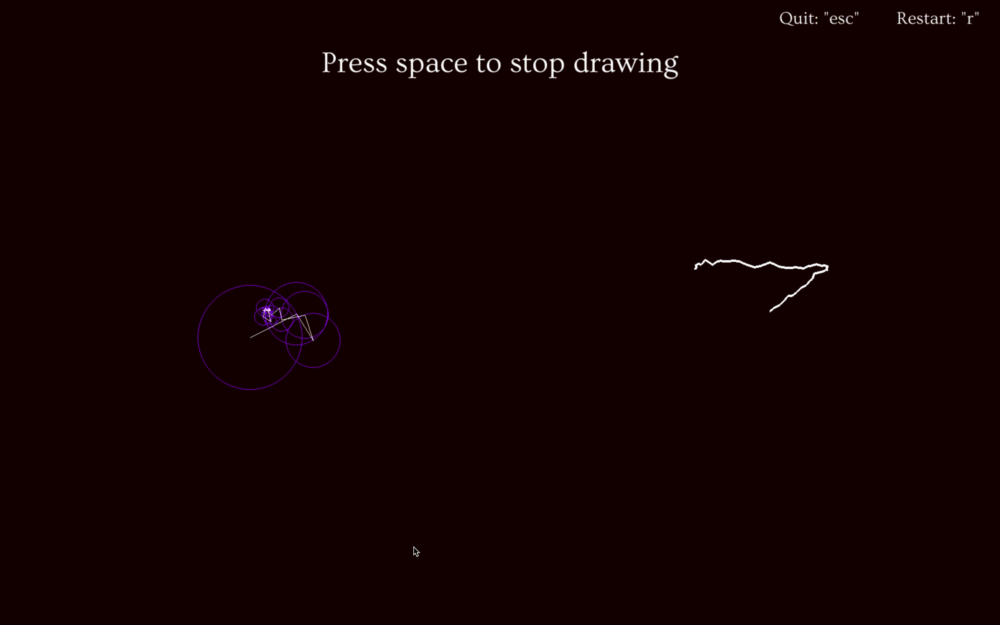
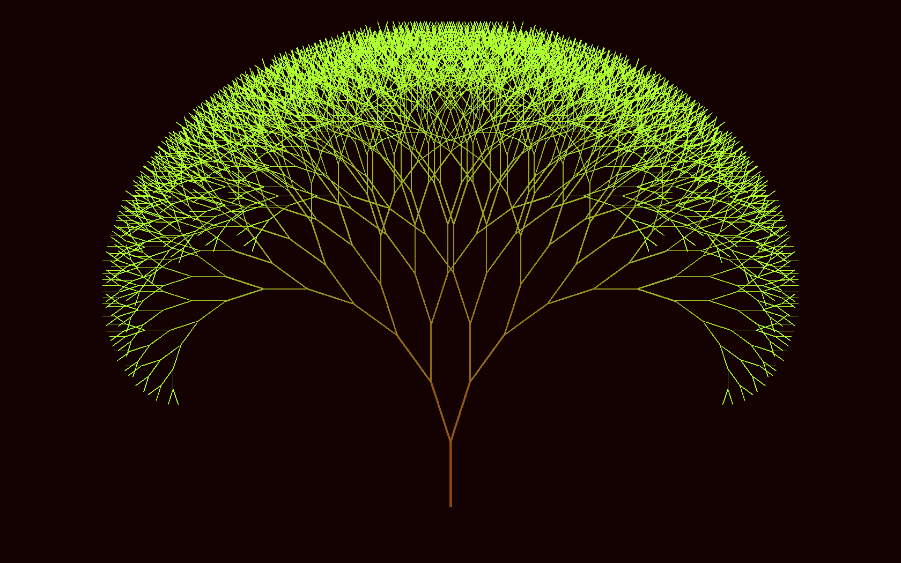
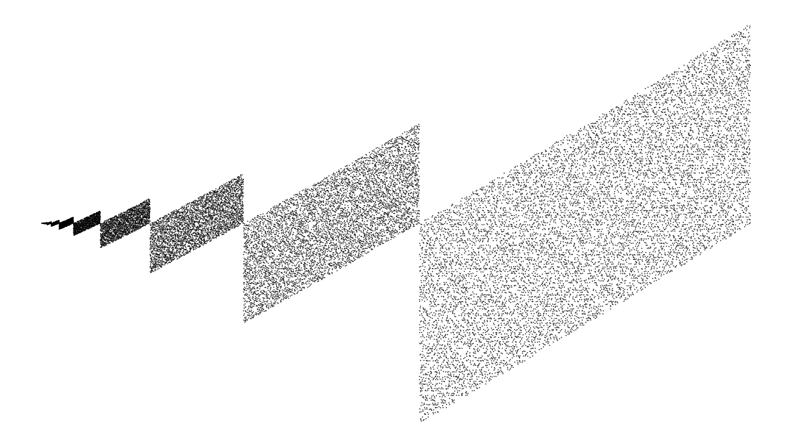
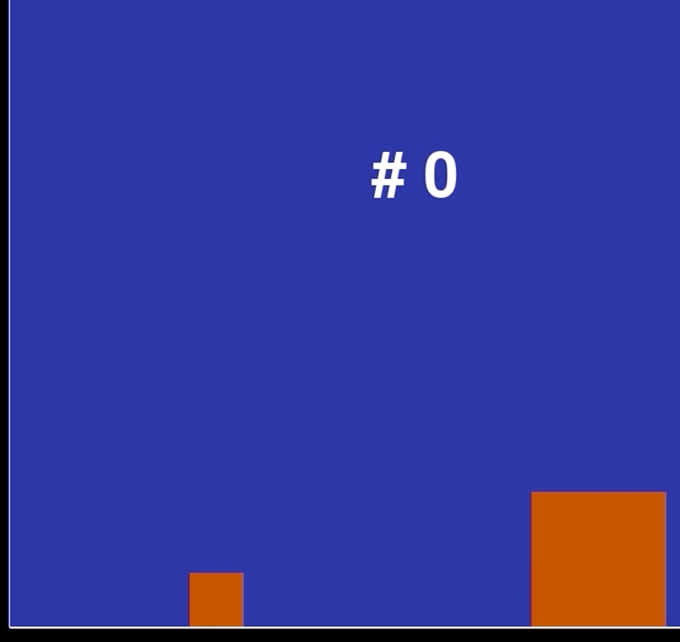
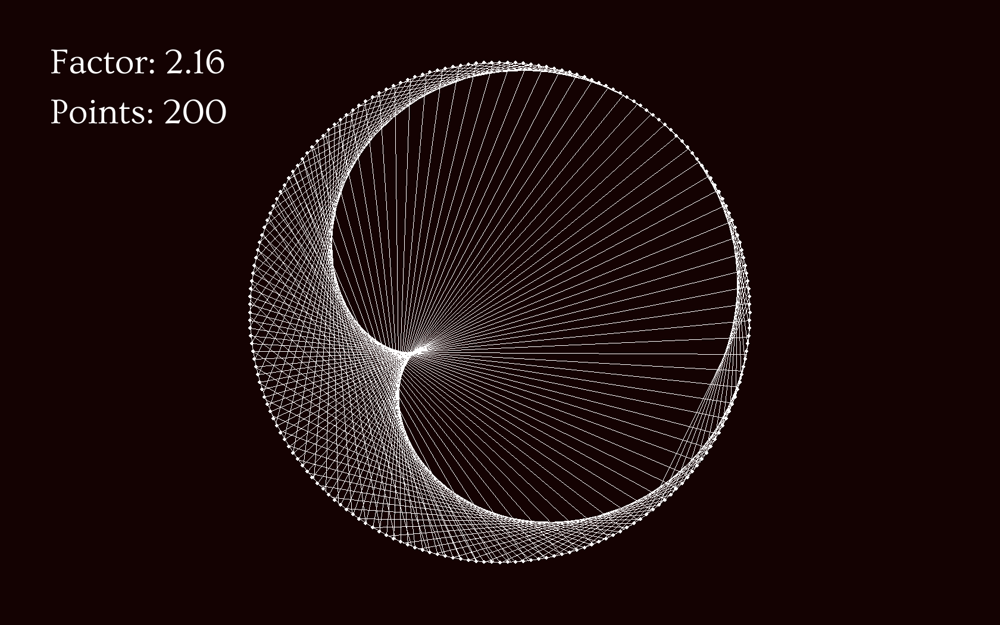

# Maths snacc :coffee:

Just scripts for different calculations, e.g. series or calculating the digits of pi using a block bouncing off a wall and another block. In the pygame simulations, "r" resets the simulation and "esc" closes the program.

### Contents
------------
:file_folder:
* [Dragon Curve](src/maths_snack/programs/dragon_curve)
* [Fractal Tree](src/maths_snack/programs/fractal_tree)
* [Times Table](src/maths_snack/programs/x_table)
* [Blocks colliding PI times](src/maths_snack/programs/pi_count)
* [Draw with circles](src/maths_snack/programs/wheelie)

:memo:
* [Ant](src/maths_snack/scripts/ant.py)
* [The Barnsley Fern](src/maths_snack/scripts/barnsley_fern.py)
* [Chaotic Ribbon](src/maths_snack/scripts/chaotic_ribbon.py) - Number series from [OEIS](https://oeis.org/A055748)
* [The Collatz conjecture](src/maths_snack/scripts/collatz.py)
* [Continued fraction](src/maths_snack/scripts/continued_frac.py)
* [The Double Pendulum](src/maths_snack/scripts/double_pend.py)
* [Forest Fire](src/maths_snack/scripts/fire.py) - Number series from [OEIS](https://oeis.org/A229037)
* [Fly Straight](src/maths_snack/scripts/fly_straight.py) - Number series from [OEIS](https://oeis.org/A133058)
* [Gaussian Elimination](src/maths_snack/scripts/gauss_elim.py)
* [Golden Ratio generator](src/maths_snack/scripts/golden.py)
* [Graham Scan](src/maths_snack/scripts/graham_scan.py) - A gift wrapping tool
* [Chaos in population growth](src/maths_snack/scripts/growth.py)
* [Conway's Game of Life](src/maths_snack/scripts/life.py)
* [The Mandelbrot Set](src/maths_snack/scripts/mandelbrot.py)
* [Monte Carlo approximation](src/maths_snack/scripts/monte_carlo.py)
* [Parallelogram](src/maths_snack/scripts/parallelogram.py) - Number series from [OEIS](https://oeis.org/A265326)
* [Pyramidal numbers](src/maths_snack/scripts/pyramidal_number.py) - Making pyramids and polygons of cannon balls
* [The Quicksort algorithm](src/maths_snack/scripts/quicksort.py)
* [Sacks Spiral](src/maths_snack/scripts/sack_spiral.py)
* [Snowy Alps](src/maths_snack/scripts/snowy.py) - Number series from [OEIS](https://oeis.org/A279125)
* [van Eck](src/maths_snack/scripts/van_eck.py) - Number series from [OEIS](https://oeis.org/A181391)

### Examples
------------
#### [The Barnsley Fern](src/maths_snack/scripts/barnsley_fern.py)

#### [Chaotic Ribbon](src/maths_snack/scripts/chaotic_ribbon.py)

#### [Collatz algorithm](src/maths_snack/scripts/collatz_test.py)

#### [Dragon Curve](src/maths_snack/programs/dragon_curve)

#### [Draw with circles](src/maths_snack/programs/wheelie)

#### [Forest Fire](src/maths_snack/scripts/fire.py)

#### [Fly Straight](src/maths_snack/scripts/fly_straight.py)

#### [Fractal Tree](src/maths_snack/programs/fractal_tree)

#### [Graham Scan](src/maths_snack/scripts/graham_scan.py)

#### [Chaos in population growth](src/maths_snack/scripts/growth.py)

#### [Parallelogram](src/maths_snack/scripts/parallelogram.py)

#### [Count Pi with colliding blocks](src/maths_snack/programs/pi_count)

#### [Sacks Spiral](src/maths_snack/scripts/sack_spiral.py)

#### [Snowy Alps](src/maths_snack/scripts/snowy.py)

#### [Times Table](src/maths_snack/programs/x_table)

