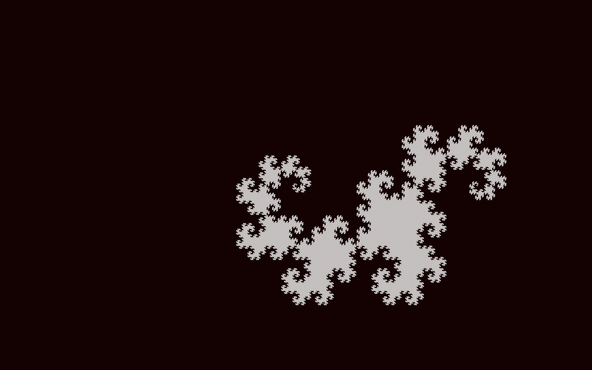
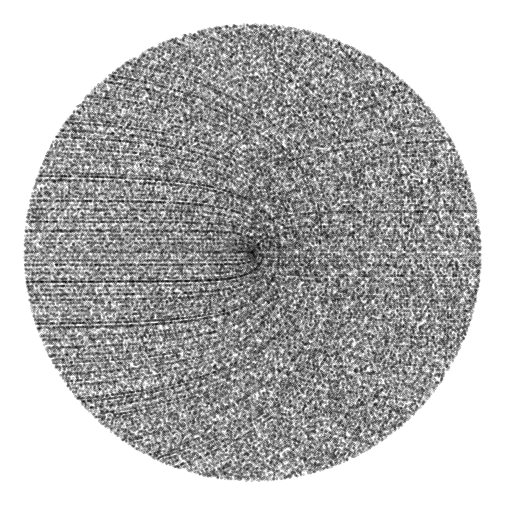
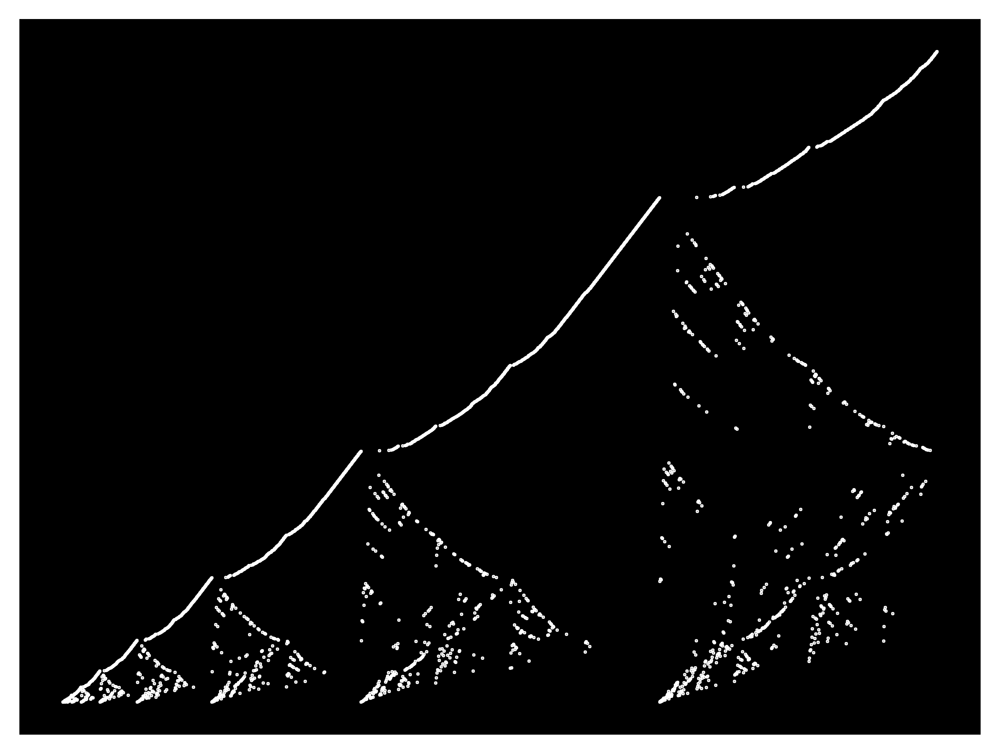

# Maths snacc :coffee:

Just scripts for different calculations, e.g. series or calculating the digits of pi using a block bouncing off a wall and another block. In the pygame simulations, "r" resets the simulation and "esc" closes the program.

### Contents
------------
:file_folder:
* [Dragon Curve](programs/dragon_curve)
* [Fractal Tree](programs/fractal_tree)
* [Times Table](programs/x_table)
* [Blocks colliding PI times](programs/pi_count)

:memo:
* [Ant](scripts/ant.py)
* [The Barnsley Fern](scripts/barnsley_fern.py)
* [Chaotic Ribbon](scripts/chaotic_ribbon.py) - Number series from [OEIS](https://oeis.org/A055748)
* [The Collatz conjecture](scripts/collatz.py)
* [Continued fraction](scripts/continued_frac.py)
* [The Double Pendulum](scripts/double_pend.py)
* [Forest Fire](scripts/fire.py) - Number series from [OEIS](https://oeis.org/A229037)
* [Fly Straight](scripts/fly_straight.py) - Number series from [OEIS](https://oeis.org/A133058)
* [Gaussian Elimination](scripts/gauss_elim.py)
* [Golden Ratio generator](scripts/golden.py)
* [Graham Scan](scripts/graham_scan.py) - A gift wrapping tool
* [Chaos in population growth](scripts/growth.py)
* [Conway's Game of Life](scripts/life.py)
* [The Mandelbrot Set](scripts/mandelbrot.py)
* [Monte Carlo approximation](scripts/monte_carlo.py)
* [Parallelogram](scripts/parallelogram.py) - Number series from [OEIS](https://oeis.org/A265326)
* [Pyramidal numbers](scripts/pyramidal_number.py) - Making pyramids and polygons of cannon balls
* [The Quicksort algorithm](scripts/quicksort.py)
* [Sacks Spiral](scripts/sack_spiral.py)
* [Snowy Alps](scripts/snowy.py) - Number series from [OEIS](https://oeis.org/A279125)
* [van Eck](scripts/van_eck.py) - Number series from [OEIS](https://oeis.org/A181391)

### Examples
------------
The Barnsley Fern

Chaotic Ribbon

Collatz algorithm

Dragon Curve

Fire

Fly Straight

Fractal Tree

Graham Scan

Growth Rate

Parallelogram

Count Pi with colliding blocks

Sack Spiral

Snowy Hills

X Table

