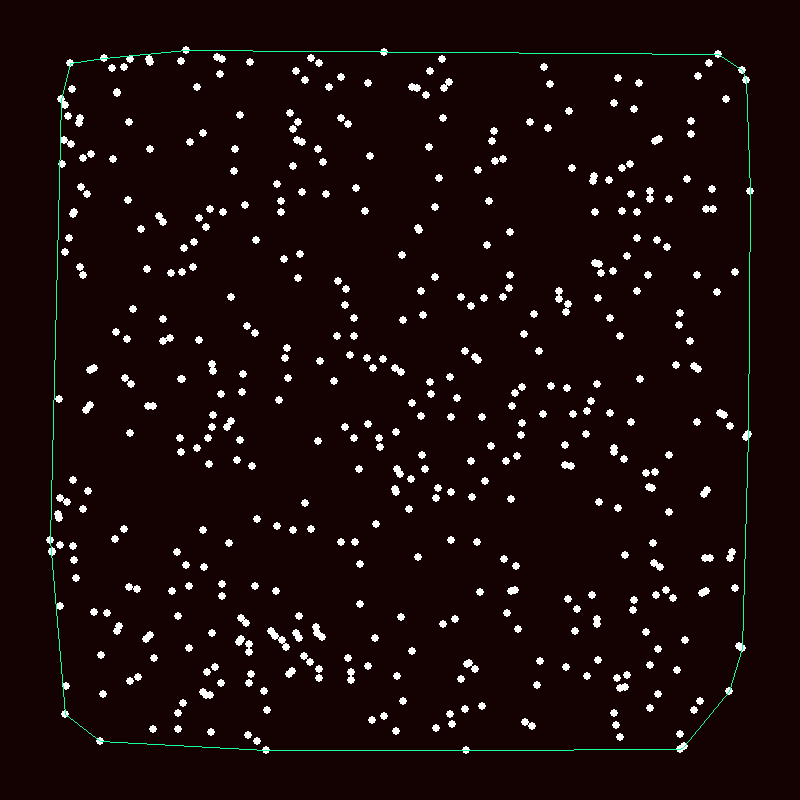

# Maths snacc :coffee:

Just scripts for different calculations, e.g. series or calculating the digits of pi using a block bouncing off a wall and another block. In the pygame simulations, "r" resets the simulation and "esc" closes the program.

## Examples
------------
### The Barnsley Fern

### Chaotic Ribbon

### Collatz algorithm

### Dragon Curve

### Draw with circles

### Forest Fire

### Fly Straight

### Fractal Tree

### Graham Scan

### Chaos in population growth

### Parallelogram

### Count Pi with colliding blocks

### Sacks Spiral

### Snowy Alps

### Times Table

